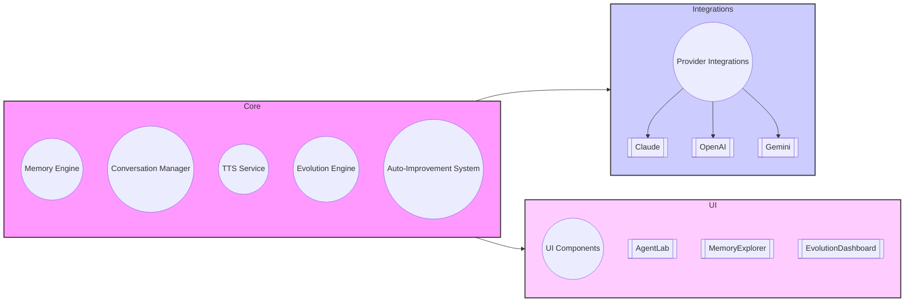

# Cyber Prompt Builder - Refactored Architecture

This document outlines the refactored architecture for the Cyber Prompt Builder codebase, focusing on modularity, separation of concerns, and testability.

## 1. Folder Structure

```
src/
├── core/                # Core application logic (framework-agnostic)
│   ├── interfaces/       # Interface definitions for all components
│   ├── models/           # Data models
│   ├── utils/            # Utility functions
│   └── services/        # Core services (Memory, Conversation, TTS, etc.)
├── integrations/       # Integrations with external services (AI providers)
│   ├── providers/       # Specific AI provider implementations (Claude, OpenAI, Gemini)
│   └── plugins/         # Plugin system
├── ui/                  # UI components (React, TailwindCSS, ShadCN/UI)
│   ├── components/       # Reusable UI components
│   ├── layouts/          # Page layouts
│   └── styles/          # Global styles and themes
├── state/               # Application state management (Zustand - optional)
├── tests/               # Tests
│   ├── unit/            # Unit tests (Vitest)
│   ├── integration/     # Integration tests (React Testing Library)
│   └── e2e/             # End-to-end tests (Playwright - optional)
├── app.tsx              # Main application component
└── main.tsx             # Entry point
```

## 2. Component Diagram



## 3. Component Details

*   **Memory Engine:**
    *   Interface: [`core/interfaces/memory-engine.ts`](relative/file/path.ext:line) (`MemoryService` interface)
    *   Input: Text content, metadata (session ID, type, tags)
    *   Output: Memory entry ID
    *   Dependencies: None (core component)
    *   Testing: Unit tests with Vitest, integration tests with React Testing Library (if UI components are involved)
*   **Conversation Manager:**
    *   Interface: [`core/interfaces/conversation-manager.ts`](relative/file/path.ext:line) (`ConversationService` interface)
    *   Input: User prompt, AI response, session ID
    *   Output: Conversation turn ID, conversation history
    *   Dependencies: Memory Engine
    *   Testing: Unit tests with Vitest, integration tests with React Testing Library (if UI components are involved)
*   **Text-to-Speech Integration:**
    *   Interface: [`core/interfaces/tts-service.ts`](relative/file/path.ext:line) (`TTSService` interface)
    *   Input: Text content
    *   Output: Audio stream
    *   Dependencies: None (core component)
    *   Testing: Unit tests with Vitest, integration tests with React Testing Library (if UI components are involved)
*   **Evolution Engine:**
    *   Interface: [`core/interfaces/evolution-engine.ts`](relative/file/path.ext:line) (`EvolutionService` interface)
    *   Input: Code, metrics
    *   Output: Improvement suggestions
    *   Dependencies: None (core component)
    *   Testing: Unit tests with Vitest
*   **Auto-Improvement System:**
    *   Interface: [`core/interfaces/auto-improvement-system.ts`](relative/file/path.ext:line) (`AutoImprovementService` interface)
    *   Input: Evolution Engine reports
    *   Output: Improvement tasks
    *   Dependencies: Evolution Engine, Memory Engine
    *   Testing: Unit tests with Vitest
*   **Provider Integrations (Claude, OpenAI, Gemini):**
    *   Interface: [`integrations/providers/provider.ts`](relative/file/path.ext:line) (`AIProvider` interface)
    *   Input: Prompt, API key
    *   Output: Code, cost estimate
    *   Dependencies: None (integration components)
    *   Testing: Unit tests with Vitest (mocking API calls)
*   **UI Components (AgentLab, MemoryExplorer, EvolutionDashboard):**
    *   Interface: React components with props
    *   Input: User interactions, data from core services
    *   Output: UI rendering
    *   Dependencies: Core services
    *   Testing: Integration tests with React Testing Library, end-to-end tests with Playwright (optional)

## 4. Dependency Injection/Service Locator

A simple **Service Locator** pattern is recommended for managing dependencies. This approach avoids the complexity of dependency injection frameworks while still providing a way to decouple components.

*   Create a `core/services/service-locator.ts` file:

    ```typescript
    const services: Record<string, any> = {};

    export function registerService(name: string, service: any) {
      services[name] = service;
    }

    export function getService<T>(name: string): T {
      return services[name];
    }
    ```

*   Register services in `main.tsx`:

    ```typescript
    import { registerService } from './core/services/service-locator';
    import { MemoryService } from './core/services/memory-service';
    import { ConversationService } from './core/services/conversation-service';
    import { TTSService } from './core/services/tts-service';
    import { EvolutionService } from './core/services/evolution-service';
    import { AutoImprovementService } from './core/services/auto-improvement-service';

    registerService('MemoryService', new MemoryService());
    registerService('ConversationService', new ConversationService());
    registerService('TTSService', new TTSService());
    registerService('EvolutionService', new EvolutionService());
    registerService('AutoImprovementService', new AutoImprovementService());
    ```

*   Access services in components:

    ```typescript
    import { getService } from './core/services/service-locator';

    const memoryService = getService<MemoryService>('MemoryService');
    ```

## 5. Circular Dependency Elimination

*   **Identify circular dependencies:** Use a tool like `madge` to detect circular dependencies in the codebase.
*   **Break cycles:**
    *   **Invert control:** Move shared functionality to a common module.
    *   **Use interfaces:** Define interfaces for dependencies instead of concrete implementations.
    *   **Lazy loading:** Use dynamic imports to break dependencies at runtime.

## 6. UI Enhancements

*   **React:** Utilize React for building UI components.
*   **TailwindCSS:** Utilize TailwindCSS for styling UI components.
*   **ShadCN/UI:** Use ShadCN/UI for pre-built, accessible UI components.
*   **Framer Motion (optional):** Add Framer Motion for smooth transitions and animations.
*   **Zustand (optional):** Use Zustand for lightweight state management.

## 7. Testing Strategy

*   **Vitest:** Use Vitest for unit testing core services and utility functions.
*   **React Testing Library:** Use React Testing Library for integration testing UI components.
*   **Playwright (optional):** Use Playwright for end-to-end testing user flows.

This architecture promotes modularity, separation of concerns, and testability. It also provides a flexible foundation for future development.