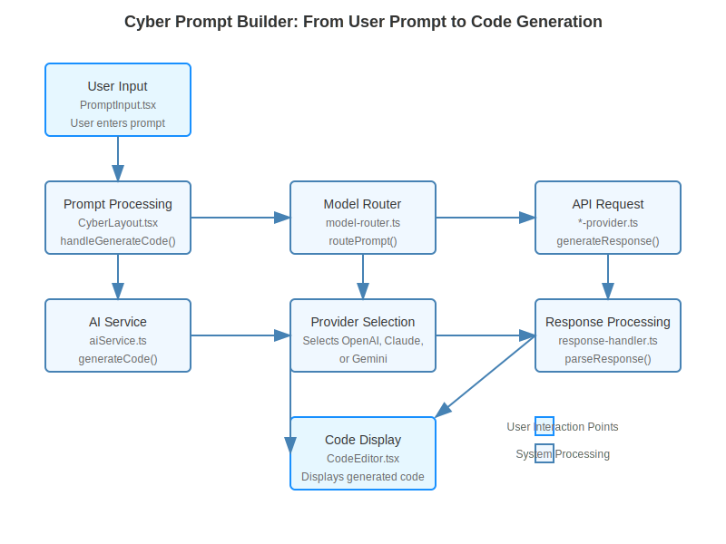

# Cyber Prompt Builder

A modular, extensible system for constructing optimized AI prompts with layered composition and generating code from natural language prompts.

## Prompt to Code Flow

The Cyber Prompt Builder application follows a well-defined path from user input to code generation:

1. **User Input**: User enters a prompt describing the code they want to generate
2. **Prompt Processing**: The prompt is enhanced and optimized
3. **Provider Selection**: The appropriate AI provider is selected (OpenAI, Claude, or Gemini)
4. **Code Generation**: The AI generates code based on the prompt
5. **Response Processing**: The response is parsed and formatted
6. **Code Display**: The generated code is displayed in the editor

## Architecture Overview

CyberPromptBuilder is designed as a layered prompt construction system that allows precise control over AI prompts through composable components. The system follows functional composition patterns with priority-based ordering.

### Core Components

- **PromptBuilder**: Central orchestration service
- **PromptLayers**: Modular components (system, task, memory, preferences)
- **CompositionStrategies**: Pluggable composition algorithms
- **Provider Integration**: Adapters for various AI providers



## Key Features

- **Layered Composition**: Build prompts from distinct semantic layers
- **Priority-Based Ordering**: Control the importance of different prompt components
- **Provider-Specific Optimization**: Format prompts optimally for each AI provider
- **Context Integration**: Seamlessly incorporate contextual information
- **Memory Support**: Include relevant previous interactions
- **Integrated Routing**: Smart provider selection based on prompt characteristics

## Integration with AI Providers

CyberPromptBuilder seamlessly integrates with multiple AI service providers:

- **Claude**: Optimized for Claude's system message format and capabilities
- **OpenAI**: Structured for chat completion endpoints
- **Gemini**: Formatted for Google's Gemini API

## Getting Started

### Production Deployment

The application is production-ready with the following features:
- ✅ Comprehensive error handling and logging
- ✅ Environment validation and security checks
- ✅ Performance optimizations and code splitting
- ✅ Security headers and input sanitization
- ✅ Browser compatibility checks
- ✅ Graceful fallbacks for missing dependencies

### Quick Start with Free AI Providers

1. **Get a Free Gemini API Key** (Recommended for beginners)
   - Visit [Google AI Studio](https://makersuite.google.com/app/apikey)
   - Sign in with your Google account
   - Create a new API key (free tier includes generous limits)
   - Copy the API key

2. **Configure the Application**
   - Set environment variable: `REACT_APP_PROVIDERS_GEMINI_API_KEY=your_key_here`
   - Or configure through the Settings UI
   - Start using the AI features!

3. **Alternative Free Options**
   - **OpenAI**: $5 free credit for new accounts at [OpenAI Platform](https://platform.openai.com/api-keys)
   - **Anthropic Claude**: Free tier available at [Anthropic Console](https://console.anthropic.com/)

### Production Deployment

#### Environment Variables
```bash
# Required
NODE_ENV=production
REACT_APP_APP_ENVIRONMENT=production

# At least one AI provider API key
REACT_APP_PROVIDERS_GEMINI_API_KEY=your_gemini_key
# OR
REACT_APP_PROVIDERS_OPENAI_API_KEY=your_openai_key
# OR
REACT_APP_PROVIDERS_CLAUDE_API_KEY=your_claude_key

# Optional configuration
REACT_APP_PROVIDERS_DEFAULT_PROVIDER=gemini
REACT_APP_AGENT_MAX_ITERATIONS=3
REACT_APP_PROMPT_BUILDER_MAX_TOKENS=4096
```

#### Build and Deploy
```bash
npm install
npm run build
npm run build:check  # Validates build output
npm start           # Starts production server
```

#### Health Checks
- Health endpoint: `/health`
- Config endpoint: `/api/config`
- Environment validation runs on startup

### Using the Chat Interface

```typescript
// The chat interface automatically handles:
// - Provider selection (Gemini, OpenAI, Claude)
// - API key management
// - Code extraction from responses
// - Error handling

// Example prompts to try:
"Create a React component for a todo list"
"Explain how async/await works in JavaScript"
"Write a Python function to sort a list"
"Help me debug this CSS flexbox layout"
```

### Advanced Usage with Prompt Builder

```typescript
import { promptBuilderService } from './services/prompt-builder';

// Create a system prompt
const systemId = promptBuilderService.createSystemPrompt(
  'You are an expert TypeScript developer.'
);

// Create a task instruction
const taskId = promptBuilderService.createTaskInstruction(
  'Create a utility function that formats dates.'
);

// Add a specific example
promptBuilderService.addTaskExample(
  taskId,
  'formatDate(new Date(), "YYYY-MM-DD") → "2025-05-11"'
);

// Create a memory layer with context
const memoryId = promptBuilderService.createMemoryLayer();
promptBuilderService.addMemoryEntry(
  memoryId,
  MemoryEntryType.CODE,
  'function getISODate(date) { return date.toISOString().split("T")[0]; }',
  'project_code'
);

// Compose the prompt
const prompt = promptBuilderService.compose();

// Generate AI content
const result = await aiService.generateCode({
  prompt: prompt.text
});
```

## Advanced Usage

### Model Router Integration

The system integrates with the model router to optimize prompts for specific providers:

```typescript
import { enhancePrompt } from './services/prompt-builder/model-router-extensions';

// Enhance a raw prompt with the builder
const enhancedPrompt = await enhancePrompt(
  { content: 'Create a React component for a to-do list' },
  {
    isCodeTask: true,
    language: 'typescript',
    provider: 'claude'
  }
);

// Send to AI provider
const result = await provider.generateCode(enhancedPrompt);
```

### Custom Composition Filters

Filter specific layers for different contexts:

```typescript
// Create a filter for only system and task layers
const filter = new SimpleLayerFilter(layer =>
  layer.type === 'system' || layer.type === 'task'
);

// Compose with the filter
const filteredPrompt = promptBuilderService.compose(filter);
```

## Documentation

For detailed documentation, see:

- [Prompt Builder Architecture](src/services/prompt-builder/README.md)
- [Service Integration Guide](src/core/interfaces/prompt-builder.ts)
- [Provider Integration](src/services/prompt-builder/provider-integration.ts)
- [Prompt to Code Flow](PROMPT_FLOW.md)
- [Prompt Examples](PROMPT_EXAMPLES.md)
- [Deployment Guide](DEPLOYMENT.md)

## Best Practices

1. **Layer Prioritization**: Assign priorities that reflect logical importance
2. **Context Management**: Include only relevant contextual information
3. **Provider Specificity**: Use provider-specific formatters for optimal results
4. **Memory Usage**: Strategically include previous interactions for continuity
5. **Preset Usage**: Leverage built-in presets for common scenarios

## License

MIT
